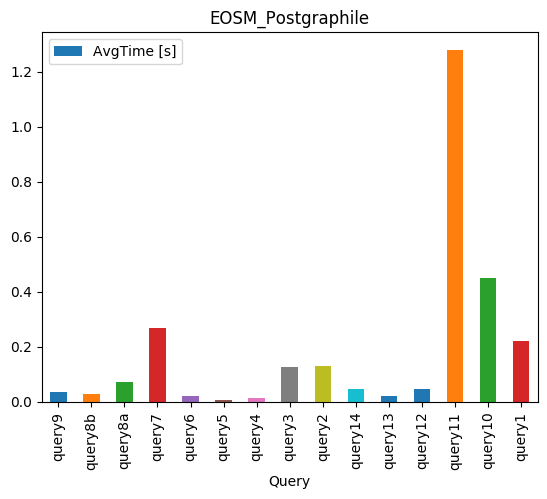

# DBaaS
To use this repo you have to install docker and docker-compose on your system.
Further, python3.6 and pip is required.

## Getting Started
For preparation clone this repository and download the two database dumps from the following sources:
   * eosm_ch: https://drive.switch.ch/index.php/s/GmghfzyjLm3BwQP
   * sakila: https://drive.switch.ch/index.php/s/LMnvH1fJlJvygHG

After that move the two dumps into the docker/data folder.
```bash
cp eosm_ch.sql docker/data
cp sakila.sql docker/data
```


Now you are ready to run the containers:
```bash
docker-compose build
docker-compose up
```

The PostGraphile and PostgREST Api should be reachable under:
  * eosm_ch DB (Geospatial data)
    * PostGraphile: https://localhost:5002
    * PostgREST: https://localhost:3001
  * Sakila DB (a lot of relations)
    * PostGraphile: https://localhost:5001
    * PostgREST: https://localhost:3000


## PostGraphile
Run: (previously, install the dependencies mentioned in the requirements.txt)
```bash
python3 graphql_requests.py
```


### Notes
  * ORDER BY multiple columns -> @graphile-contrib/pg-order-by-related
  * GROUP BY not possible -> Views
  * SUM not possible -> Views (wip @graphile/pg-aggreates)
  * Nested Queries not possible -> View (7a..)
  * Extended docs would be nice

Used plugins:
  * postgraphile-plugin-connection-filter
  * @graphile/postgis
  * @graphile-contrib/pg-order-by-related
  * @graphile/pg-aggreates (doesn't work until now)


## PostgREST
Run: (previously, install the dependencies mentioned in the requirements.txt)
```bash
python3 postgrest_requests.py
```


### Notes
  * Nice API Doc / Swagger (http://postgrest.org/en/v5.2/api.html)
  * Aggregations not possible (COUNT, SUM) -> Views
  * Nested Queries not possible -> Views
  * Multiple Join Filter results in null -> Change direction (7c)
  * No Geo-Spatial queries -> Views


## ToDo
 - [x] pg_prewarm
 - [x] average query time
 - [x] pgTune
 - [ ] osm_stops reference to didok_stops for postgraphile
 - [ ] Prepare slides for a presentation (mention requests.elapsed.total_seconds)

## Impressions



